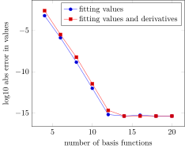

+++
title = "Approximating a function using derivatives"
date = "2022-09-20"
tags = ["julia", "numerical", "SpectralKit.jl", ]
rss = "."
+++

When simulating from an economic model, I had to approximate a function
$f(x; \theta): [0,1] \to [0,1]$ for a variety of $\theta$s. $f$ itself has to be solved for numerically,
but otherwise it is pretty friendly, being continuous and increasing, with $f(0)=0$ and
$f(1)=1$.

After profiling, this turned out to be the most costly part, so I had to approximate it.
Since I needed derivatives $f'(x)$, I was wondering whether making the approximation match
them (known as a [Hermite
interpolation](https://en.wikipedia.org/wiki/Hermite_interpolation)) would increase
accuracy.

The (pedagogical, unoptimized) code below sums up the gist of my numerical experiments,
with `f` below standing in for my implicitly solved function. It also demonstrates the new
features of [SpectralKit.jl](https://github.com/tpapp/SpectralKit.jl/) `v0.10`.

First, we set up the problem:

````julia
using SpectralKit, PGFPlotsX, DisplayAs

f(x) = (exp(x) - 1) / (exp(1) - 1)
f′(x) = exp(x) / (exp(1) - 1)
const I = BoundedLinear(0, 1)   # interval we map from
````

Then define an interpolation using `N` Chebyshev nodes, matching the values.

````julia
function interpolation0(f, N)
    basis = Chebyshev(EndpointGrid(), N)
    ϕ = collocation_matrix(basis) \ map(f ∘ from_pm1(I), grid(basis))
    linear_combination(basis, ϕ) ∘ to_pm1(I)
end;
````

Same exercise, but with the derivatives too, so we need two bases, one with double the
number of functions (so we need to make sure `N` is even), while we just use `N/2` for the
nodes.

````julia
function interpolation01(f, f′, N)
    @assert iseven(N)
    basis1 = Chebyshev(EndpointGrid(), N ÷ 2) # nodes from this one
    basis2 = Chebyshev(EndpointGrid(), N)     # evaluate on this basis
    x = from_pm1.(I, grid(basis1))            # map nodes from [-1,1]
    M = collocation_matrix(basis2, to_pm1.(I, derivatives.(x)))
    ϕ = vcat(map(y -> y[0], M), map(y -> y[1], M)) \ vcat(f.(x), f′.(x))
    linear_combination(basis2, ϕ) ∘ to_pm1(I)
end;
````

Importantly, note that mapping to [-1,1] for the collocation matrix has to be preceded by
lifting to derivatives.

Then calculate the max abs difference, in digits (`log10`).

````julia
function log10_max_abs_diff(f, f̂; M = 1000)
    x = range(0, 1; length = M)
    log10(maximum(@. abs(f(x) - f̂(x))))
end;
````

Then let's explore the errors in values ...

````julia
Ns = 4:2:20
errors = [(log10_max_abs_diff(f, interpolation0(f, N)),
           log10_max_abs_diff(f, interpolation01(f, f′, N)))
          for N in Ns]
````

````
9-element Vector{Tuple{Float64, Float64}}:
 (-3.1996028783051695, -2.594513489315976)
 (-5.882145733021446, -5.488666848393999)
 (-8.835160643191552, -8.232779398084544)
 (-11.994023867372805, -11.44897859894945)
 (-15.176438519807359, -14.664555158828485)
 (-15.35252977886304, -15.35252977886304)
 (-15.255619765854984, -15.35252977886304)
 (-15.35252977886304, -15.35252977886304)
 (-15.35252977886304, -15.35252977886304)
````

... and derivatives.

````julia
d_errors = [(log10_max_abs_diff(f′, (x -> x[1]) ∘ interpolation0(f, N) ∘ derivatives),
             log10_max_abs_diff(f′, (x -> x[1]) ∘ interpolation01(f, f′, N) ∘ derivatives))
            for N in Ns]
````

````
9-element Vector{Tuple{Float64, Float64}}:
 (-2.0758500387125216, -2.093336352131656)
 (-4.549339116162139, -4.611253272379436)
 (-7.363367596306161, -7.429305371299876)
 (-10.417554370684012, -10.485171320264207)
 (-13.381718167990524, -13.689771947181466)
 (-13.834015838985154, -14.374806173574193)
 (-14.03551167781493, -14.539616422220185)
 (-13.724140848812729, -14.750469787535078)
 (-13.714040521908403, -14.724140848812729)
````

Finally the plots:

````julia
@pgf Axis({ xlabel = "number of basis functions",
            ylabel = "log10 abs error in values",
            legend_cell_align= "left" },
          PlotInc(Table(Ns, first.(errors))),
          LegendEntry("fitting values"),
          PlotInc(Table(Ns, last.(errors))),
          LegendEntry("fitting values and derivatives")) |> DisplayAs.SVG
````


````julia
@pgf Axis({ xlabel = "number of basis functions",
            ylabel = "log10 abs error in values",
            legend_cell_align= "left" },
          PlotInc(Table(Ns, first.(d_errors))),
          LegendEntry("fitting values"),
          PlotInc(Table(Ns, last.(d_errors))),
          LegendEntry("fitting values and derivatives")) |> DisplayAs.SVG
````


The conclusion is that even without matching them explicitly, derivatives are
well-approximated. Getting an extra digit of accuracy in derivatives above 12--14 nodes
means sacrificing a digit of accuracy with a low number of nodes. 14 seems to be the
break-even point here, but then we are at machine precision anyway.

As usual, simply approximating with Chebyshev polynomials is extremely accurate in itself
for practical purposes, even when derivatives are needed. Of course, this depends on the
function being “nice”.

~~~
<div class="source_footer">
~~~
This page was generated using [Literate.jl](https://github.com/fredrikekre/Literate.jl).\
Download [the source, project, and manifest](hermite-approximation-spectralkit_source.tar).
~~~
</div>
~~~
